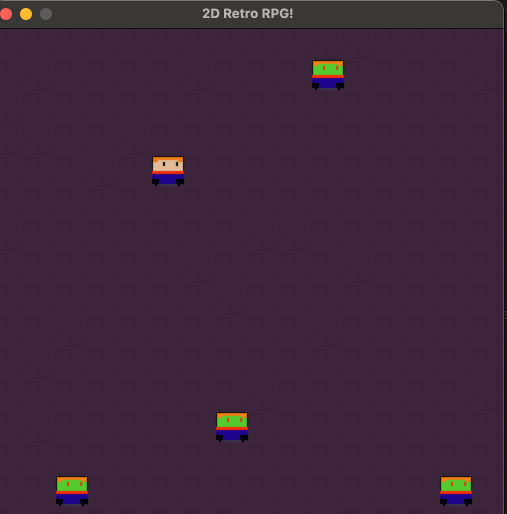

# 2D Retro RPG



2D RPG game with basic collision detection, enemy AI with A\* pathfinding, and particle effects.

## Features

- Top-down 2D movement
- Combat system with projectiles
- Enemy AI with A\* pathfinding
- Particle effects
- Sprite animations

## Running the Game

```bash
python main.py
```

## Controls

- Arrow keys: Move player
- Space: Shoot fireball
- ESC: Quit game
